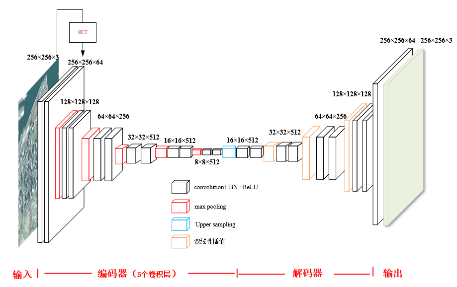
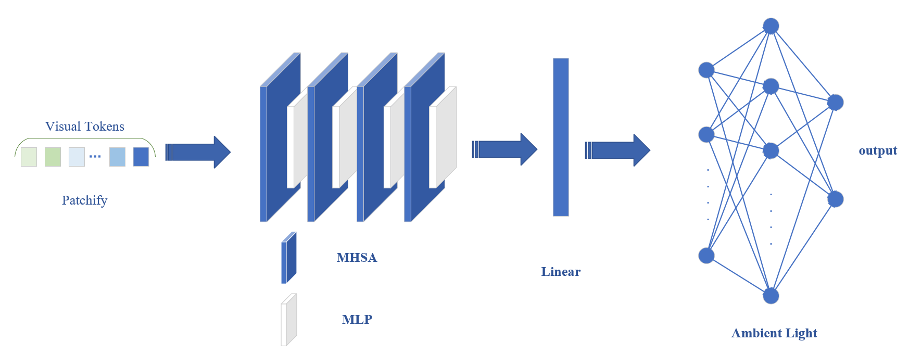

# PA-UIENet: 基于物理感知的水下图像增强方法

本项目提出并实现了一种基于物理感知双流网络的水下图像增强方法（PA-UIENet）。该方法通过结合物理模型与深度学习技术，有效解决了水下图像中普遍存在的颜色失真和对比度降低问题。该项目还开发了一个在线平台，用户可以上传水下图像，系统将实时生成增强后的图像。

## 项目简介

PA-UIENet采用双流结构：
- **传输估计流（T-Stream）**：用于估计图像中光线的传输衰减。

- **环境光估计流（A-Stream）**：估计场景中的背景环境光。


通过这两个流，PA-UIENet可以准确恢复图像中的细节和色彩，提升水下图像质量。

## 功能特色

- **物理感知双流网络**：结合物理模型和深度学习，有效处理水下图像退化。
- **在线图像增强平台**：用户可以通过简单的网页界面上传水下图像，实时获取增强结果。
- **半监督学习框架**：在有限标注数据的情况下，通过半监督学习框架提升网络的泛化能力。


## 项目关键结构

```bash
├── enhanced/                 # 增强后的图像目录
├── loss/                     # 损失函数相关文件
├── net/                      # 网络架构相关文件
├── saved_models/             # 保存的模型权重
├── static/                   # 前端静态文件（CSS、JavaScript等）
├── templates/                # 前端HTML模板文件
├── app.py                    # Flask应用入口，处理图像展示等
├── requirements.txt          # 项目依赖项文件
├── run.py                    # 训练
├── test.ipynb                # 测试用Jupyter Notebook
├── train.ipynb               # 训练用Jupyter Notebook
```

## 项目展示

### 平台功能演示

我们提供了一个基于Flask的在线平台，用户可以通过上传图片获取增强后的图像。此平台使用PA-UIENet模型进行推理，并在页面上展示处理结果。


### 项目成果

- 成功训练了PA-UIENet模型，能够显著改善水下图像的清晰度和颜色表现。
- 开发了一个基于Flask的在线图像处理平台，用户可以上传并处理自己的水下图像。

## 安装与运行

### 环境依赖

请确保系统安装了以下依赖项：

- Python 3.12
- Pytorch
- numpy
- Opencv
- Flask
- ······


可以通过以下命令安装依赖：

```bash
pip install -r requirements.txt
```

### 运行模型

1. **训练模型与测试**  
   如果需要重新训练模型，可以使用jupyter运行相应代码。


2. **启动平台**  
   启动Flask服务器以访问图像增强平台：

   ```bash
   python app.py
   ```

   服务器启动后，打开浏览器并访问`http://localhost:5000`。

## 数据集

本项目使用了公开数据集和自行采集的水下图像数据。由于实际水下环境的数据较难获取，团队进行了实地考察，收集了大量真实水下图像用于模型训练。


## 开发团队

- **项目负责人**：燕庭轩
- **核心成员**：符镇侃、赵网、刘昭维
- **指导教师**：赵正

## 致谢

特别感谢大连海事大学的支持以及团队成员的共同努力！
